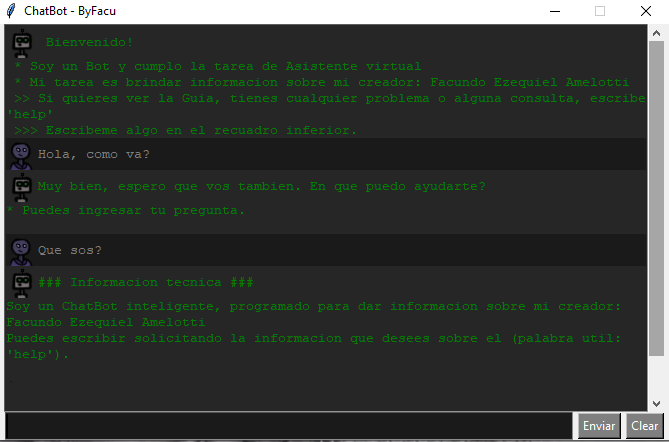
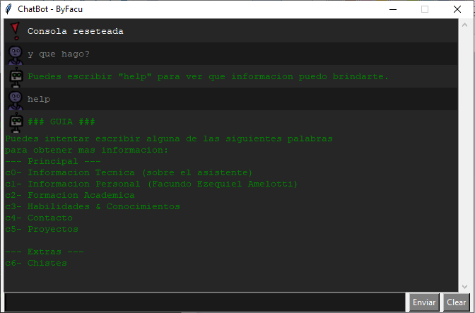
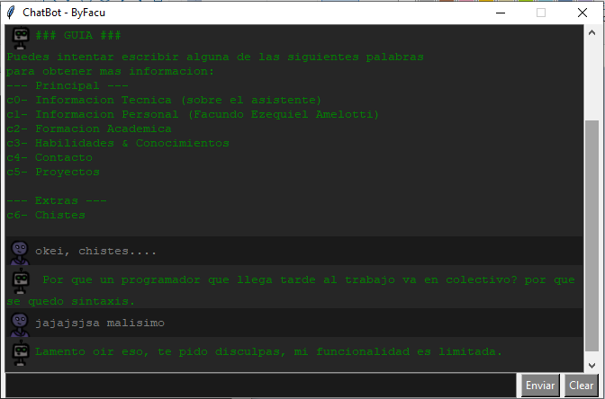

# ChatBot_Assistant
- La herramienta ChatBot, utiliza un motor de procesamiento llamado RiveScript para generar respuestas. 
- El software brinda al usuario una interfaz gráfica que le permite ingresar y enviar un mensaje con el fin de que el chatbot responda automáticamente a través de la misma interfaz gráfica mediante una consola.

    
    
    

---
